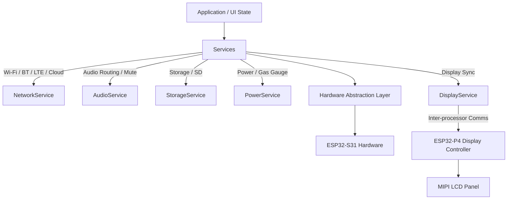
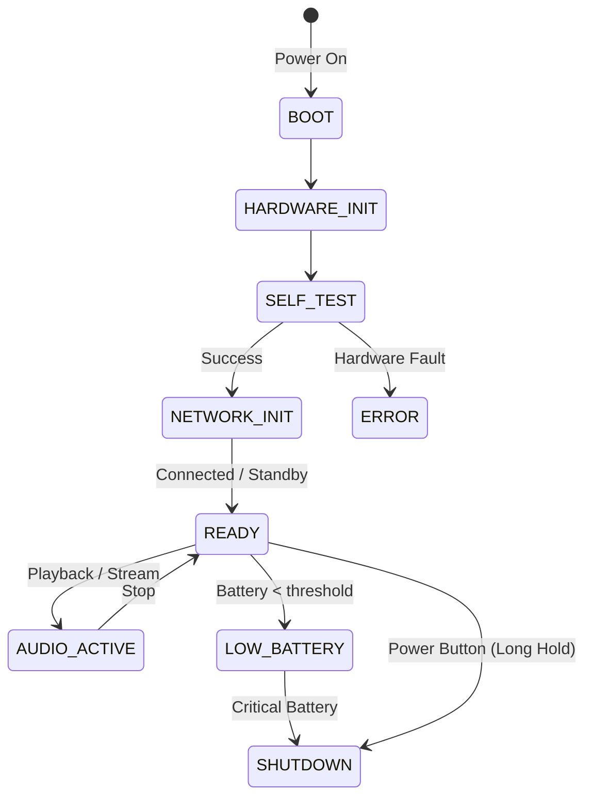

# AuxIoT Smart Audio Firmware Architecture & Implementation Plan

> [!NOTE]
> This plan addresses the first phase of the AuxIoT Smart Audio Firmware Development as defined in the Master Prompt. It outlines the product architecture, system state machine, and critical hardware dependencies based on the provided ME/EE specifications. 

## 1. Product Architecture

The AuxIoT Smart Audio is a smart audio and display device designed for connectivity, high-quality audio I/O, and user interactivity, primarily controlled through cloud/app interfaces provided by Shunno.

**Major Subsystems & Processors:**
- **ESP32-S31-WROOM (16MB Flash, 16MB PSRAM):** The primary system-on-chip (SoC). Responsible for main application logic, Wi-Fi 6, Bluetooth 5.4, LTE connectivity integration, cloud communication (MQTT/REST), storage management (SD card), audio routing, buttons, power/gas gauge monitoring, and system state/OTA.
- **ESP32-P4:** Dedicated display processor. Responsible for driving the 8.88-inch TFT LCD (480x1920) over a 2-lane or 4-lane MIPI interface, handling the UI framework and rendering.
- **Connectivity:** Wi-Fi 6, BT 5.4, and a Quectel EG916Q-GL LTE Cat 1 bis module (with eSIM).
- **Audio:** 
  - Inputs: 3.5mm mic jack, 6.35mm mic jack.
  - Output: 3.5mm line out (Max 1Vrms).
- **Storage:** Internal 16GB SD card (for media, logs, OTA cache, config).
- **Power:** 2S1P 21700 battery pack (7.4V/5000mAh) with a gas gauge. Charged via USB-C with 30W PD.
- **User Interface:** 
  - RGB Status LED (non-blinking).
  - 5 Physical Buttons: Power, Menu/Mode, Vol+, Vol-, Mic On/Off.

**Logical Flow:**

## 2. Processor Roles & Multi-Processor Communication

- **ESP32-S31:** Main application controller.
- **ESP32-P4:** UI and display renderer.

**Inter-Processor Communication (IPC) Design:**
To be finalized upon schematic review. Typically, high-speed SPI or UART is used between ESP32 ICs if rendering data isn't directly passed. Because ESP32-P4 handles its own UI logic, communication will likely be a command-based protocol (UART or SPI).
- **Format:** Binary packet with Header, Command ID, Payload, Checksum (CRC16).
- **Events:** Wi-Fi/LTE state changes, audio status, battery levels, menu button presses sent from S31 to P4.

## 3. Hardware Dependency Analysis

| Subsystem | IC/Device | Interface | GPIO/Pins | Voltage | Status / Required Info |
|---|---|---|---|---|---|
| **Main SoC** | ESP32-S31-WROOM | N/A | TBD | 3.3V | *Needs Schematic (Pin Map)* |
| **Display SoC** | ESP32-P4 | UART/SPI (to S31) | TBD | TBD | *Needs Schematic & IPC approach* |
| **Display Panel** | 8.88" TFT LCD | MIPI (2/4-lane) | TBD | TBD | *Needs Panel Datasheet & Init Sequence* |
| **LTE Modem** | Quectel EG916Q-GL | UART/USB | TBD | 3.3V | *Needs AT Command Manual, Power/Reset Pins* |
| **SD Card** | 16GB Internal SD | SDMMC / SPI | TBD | 3.3V | *Needs Schematic (Pin Map)* |
| **Battery Gauge** | TBD | I2C | TBD | TBD | **UNKNOWN** - *Needs IC Part Number / Datasheet* |
| **Audio Codec/DSP** | TBD | I2S | TBD | TBD | **UNKNOWN** - *Needs IC Part Number for 3.5/6.35mm inputs and line-out* |
| **USB-C PD** | TBD | I2C / CC Pins | TBD | TBD | **UNKNOWN** - *Needs PD Controller Part Number* |
| **Buttons** | 5x Tactile | GPIO | TBD | TBD | *Needs Schematic (Active High/Low?)* |
| **RGB LED** | TBD (Neopixel or raw?) | PWM / RMT / I2C | TBD | TBD | *Needs Schematic* |

## 4. System State Machine

## 5. Required Engineering Inputs

> [!CAUTION]
> PIN MAP NOT PROVIDED — DO NOT INVENT GPIO ASSIGNMENTS
> We cannot proceed to write functional firmware drivers without the following hardware details.

### REQUIRED FROM HARDWARE TEAM / USER
1. **Complete Schematic / PCB Pin Mapping:** For all ESP32-S31 and ESP32-P4 GPIO assignments.
2. **Audio Architecture:** What exact Audio Codec/ADC/DAC ICs are used for the 3.5mm line out and mic inputs? Are they connected via I2S to the ESP32-S31? 
3. **Battery Gas Gauge & PD Controller:** Part numbers and datasheets (I2C addresses).
4. **Display Implementation Details:** Panel datasheet, initialization sequence, and confirmation of how ESP32-S31 communicates with ESP32-P4 (UART vs. SPI vs. other).
5. **Modem Connections:** Are we using UART or USB to communicate with the Quectel EG916Q-GL? What GPIOs control its Power Key and Reset?
6. **Cloud API & UI Assets:** Shunno endpoint specifications, MQTT topics, and UI resources for the ESP32-P4.

## 6. Next Steps

1. **User Feedback Needed:** Please review the "Required Engineering Inputs" and provide any available schematics, IC part numbers, or datasheets.
2. If hardware docs are not yet finalized, we can begin building hardware-agnostic core services (State Machine, Event Bus, WiFi Manager logic, OTA logic framework) while waiting for GPIO and IC details.

Would you like to start building the core framework (Event Bus, State Machine, project scaffolding) using ESP-IDF, or do you have hardware documentation you can share first?
